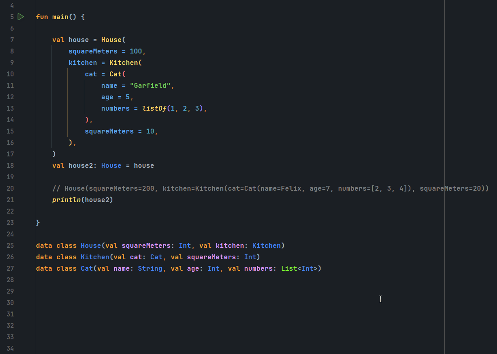
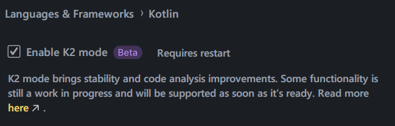

[](https://repo1.maven.org/maven2/com/javiersc/kotlin/kopy-compiler/)
[](https://oss.sonatype.org/content/repositories/snapshots/com/javiersc/kotlin/kopy-compiler/)

[](https://github.com/JavierSegoviaCordoba/kopy/tree/main)
[](https://sonarcloud.io/dashboard?id=com.javiersc.kotlin.kopy)
[](https://sonarcloud.io/dashboard?id=com.javiersc.kotlin.kopy)
[](https://sonarcloud.io/dashboard?id=com.javiersc.kotlin.kopy)

# Kopy



## Usage

### IntelliJ IDEA or Android Studio configuration

#### Enable K2 compiler in the IDE settings:

```
File > Settings > Language & Frameworks > Kotlin > Enable K2 mode
```

It is necessary to restart the IDE to do the next step.



#### Allow third party K2 plugins:

Popup the quick search with `shift + shift` and type `Registry...`, then search for:

```
kotlin.k2.only.bundled.compiler.plugins.enabled
```

And uncheck it.


### Download

Apply the plugin in the `build.gradle.kts` or `build.gradle`:

```kotlin
plugins {
    id("com.javiersc.kotlin.kopy") version $version
}
```

### Example

```kotlin
import com.javiersc.kotlin.kopy.Kopy

fun main() {
    val house = House(
        squareMeters = 100,
        kitchen = Kitchen(
            cat = Cat(
                name = "Garfield",
                age = 5,
                numbers = listOf(1, 2, 3),
            ),
            squareMeters = 10,
        ),
    )
    val house2: House = house.copy {
        squareMeters = 200
        kitchen.cat.name = "Felix"
        kitchen.cat.age = 7
        kitchen.cat.numbers.updateEach { it + 1 }
        kitchen.squareMeters = 20
    }

    // House(squareMeters=200, kitchen=Kitchen(cat=Cat(name=Felix, age=7, numbers=[2, 3, 4]), squareMeters=20))
    println(house2)
}

@Kopy
data class House(val squareMeters: Int, val kitchen: Kitchen)

@Kopy
data class Kitchen(val cat: Cat, val squareMeters: Int)

@Kopy
data class Cat(val name: String, val age: Int)
```

## Features

### `copy` or `invoke`

`copy` and `invoke` create a new instance of the data class with the content specified. There is no
difference between both functions.

### `set` or `=`

`set` and `=` do the same, assigning a value.

```kotlin
val house2: House = house.copy {
    kitchen.cat.name = "Felix"
}

val house3: House = house.copy {
    kitchen.cat.name.set("Felix")
}
```

### `update`

`update` is a lambda which allows updating the value of the property while having access to the
current value.

```kotlin
val house2: House = house.copy {
    kitchen.cat.name.update { name -> "$name Jr." }
}
```

### `updateEach`

`updateEach` is a lambda that allows updating the values of an `Iterable` while having access to the
current value of each element.

```kotlin
val house2: House = house.copy {
    kitchen.cat.numbers.updateEach { it + 1 }
}
```

## How it works

The plugin transforms the lambda into what a developer would do manually with `copy` functions,
that means the `copy` or `invoke` lambda can only work if the plugin is applied to the project it is
being called.

If the plugin is not applied, the `copy` and `invoke` function calls will be marked as
errors. Don't suppress them without applying the plugin as they will not work.

It is not necessary to suppress them manually, the Gradle plugin will suppress them automatically.

There is no reflection or mutability, the class will have some new functions and properties added,
as it will extend under the hood the `Kopyable` interface.

The number is limited to 7 independently of the number of properties the data class has:

- `copy` function
- `invoke` function
- `_initKopyable` function
- `_atomic` property
- `set` function
- `update` function
- `updateEach` function

When the Context Parameters feature is available, the `Kopyable` interface will not be necessary and
the number of properties and methods added to the data class will be reduced to only 2:

- `copy` function
- `invoke` function

A new `KopyableScope` will be created, and it will be used to store the rest of properties, and it
will be added as a context parameter to the `copy` and `invoke` lambdas:

```kotlin
data class House(val squareMeters: Int, val kitchen: Kitchen) {

    fun copy(block: KopyableScope.() -> Unit): T = ...

    fun invoke(block: KopyableScope.() -> Unit): T = ...
}
```
